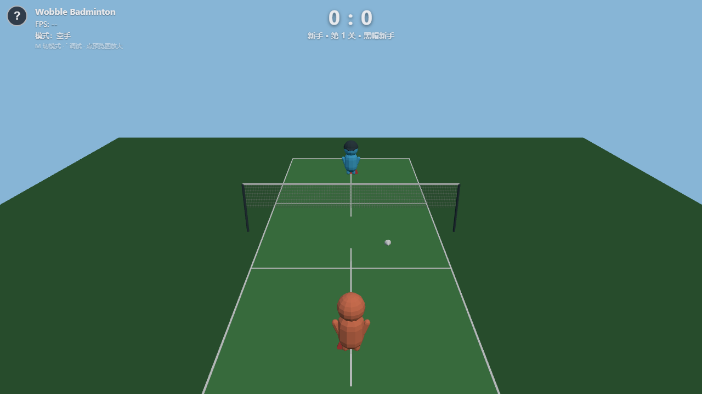
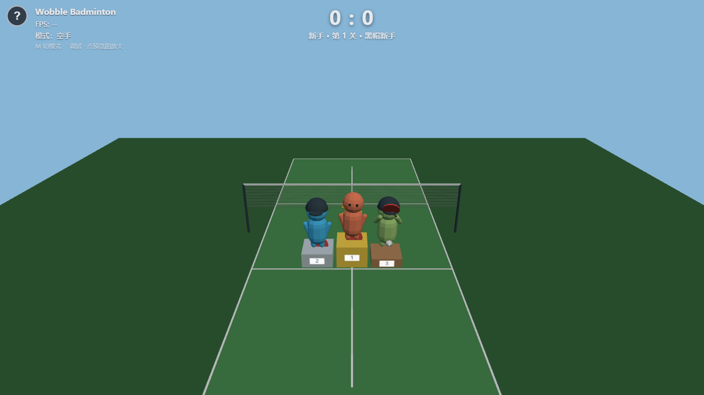

# Wobble Badminton 体感羽毛球

不用 VR、只靠普通摄像头就能玩的轻量 3D 体感羽毛球小游戏。站在摄像头前挥挥手，屏幕里的呆萌低模小人替你挥拍——握拳就击打，连握两下跳起扣杀。

## 在线玩

👉 **https://davidchen99.github.io/wobble-badminton/**

- 电脑 Chrome / Edge 体验最佳；需要允许摄像头权限
- 手机请横屏（未做专门适配，能玩但界面按桌面设计）

## 怎么玩

- **移动**：空手模式下，手左右移 = 跑位，手往前伸/收回 = 前后移动
- **击打**：握拳一下 = 正板直打（球到附近撩一下就能中）
- **扣杀**：连握两下 = 跳起扣杀，球更快更平
- **键盘+持物模式**：按 M 切换；WASD 移动 + 手持小物件快速挥动 = 击打
- **赛制**：6 分快局（默认）/ 21 分标准赛（右上角入口），先到分数直接获胜
- **关卡**：新手三关（黑帽新手 → 橙帽好手 → 王冠 Boss）；通关后解锁专业三关（紫影 → 紫电 → 魔王，紫色荧光，反应快、会扣杀）
- **荣誉**：单场首胜拿小奖杯；通关三关上 1/2/3 领奖台
- **帮助**：左上角 ? 按钮或按 H，可随时重进新手引导

## 本地运行

- Windows：双击 `启动游戏.bat`（自动启动服务器并打开浏览器；关闭黑色控制台窗口即退出）
- 命令行：`npm install && npm run dev`，浏览器打开 http://localhost:5173

## 技术

Vite + TypeScript + Three.js + MediaPipe Tasks Vision（手部追踪，模型与 wasm 已本地化，推理跑在 Worker 里不卡渲染）+ Web Audio（全程序化音效，无音频素材）。

## 文档

- `AGENTS.md` — 开发规则与最高原则
- `docs/PRD.md` — 产品需求
- `docs/GAME_DESIGN.md` — 核心玩法与难度数值
- `docs/TECH_SPEC.md` — 技术架构与性能预算
- `docs/ART_DIRECTION.md` — 美术方向
- `docs/MVP_PLAN.md` — 里程碑计划
- `TASKS.md` — 开发任务清单与实测记录

## License

MIT（见 `LICENSE`）。手部追踪模型与 wasm 为 Google MediaPipe 资产，Apache 2.0（见 `NOTICE`）。
